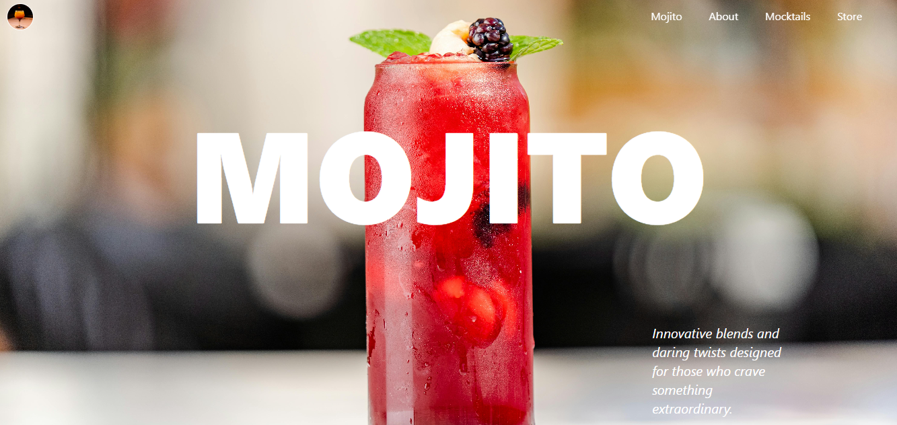
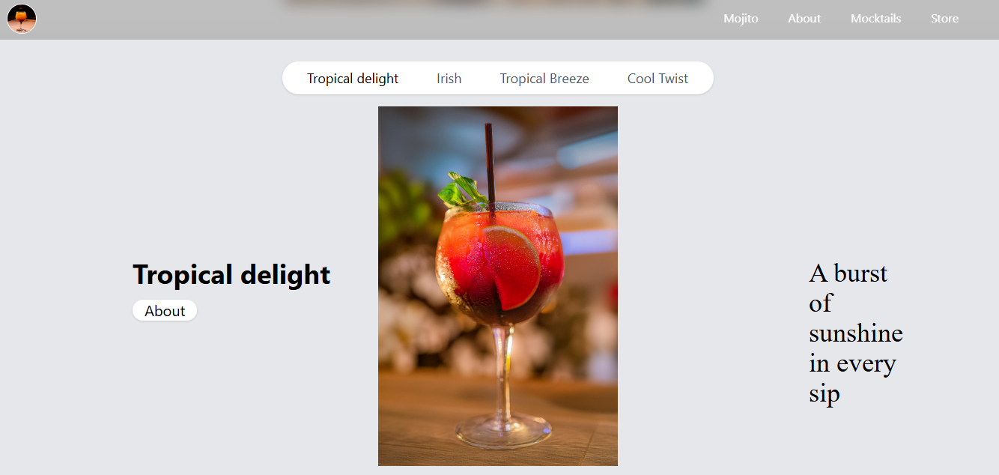

# 🍹 Mocktails WebApp

A modern and visually engaging web application showcasing refreshing mocktails.  
Built with **React.js**, styled using **Tailwind CSS**, animated with **GSAP**, and enriched with beautiful royalty-free images from **Pexels**.

---

## ✨ Features

- **Responsive UI**: Fully mobile-friendly design using Tailwind CSS.
- **Smooth Animations**: GSAP-powered transitions and effects for delightful interactions.
- **Image Showcase**: High-quality mocktail images sourced from [Pexels](https://www.pexels.com).
- **Dynamic Components**: Modular React components for easy scalability.
- **Fast Performance**: Optimized build with React and Tailwind.
- **Fast Development**: Powered by Vite for lightning-fast builds and hot reloading.

---

## 🛠️ Tech Stack

| Technology   | Purpose                                  |
|--------------|------------------------------------------|
| React.js     | Frontend framework for building UI       |
| Tailwind CSS | Utility-first CSS styling                |
| GSAP         | Animation library for smooth transitions |
| Pexels       | Source of mocktail images                |

---

## 🚀 Getting Started

### Prerequisites
- Node.js (v16 or above recommended)
- npm or yarn package manager

### Installation
1. Clone the repository:
   ```bash
   git clone https://github.com/Ayushhrajput/mocktails-gsap.git
   cd mocktails-gsap
   ``` 

## Install dependencies

```bash
npm install
# or
yarn install
```
### Usage
```bash 
npm run dev
# or
yarn dev
```
### Deployment

```bash
npm run build
# or
yarn build
```


## Project Screenshots




## Acknowledgements
- GSAP
- Pexels for free stock images

## 📜 License
This project is licensed under the MIT License.

